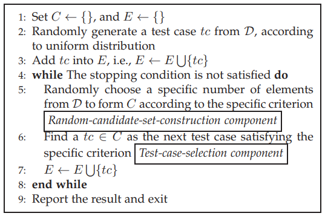

# Adaptive Random Test 过程报告

**ART测试小组：**201250026 胡睿（组长）

​							201250013 杨昊锦

## 1. 项目介绍

本项目针对数值程序领域，旨在复现现有的经典的自适应随机测试算法，并对其进行有效性比较。项目的基本框架来自于 [ARTEmpirical-main](https://box.nju.edu.cn/d/9288e9a87a5c4c3c961e/), 我们在框架代码的基础上实现了多种自适应测试算法，以及检测真实数值程序的测试功能。

## 2. 框架介绍

### src/faultZone

Simulation settings, no modification required
strore the various failure pattern including:

```
FaultZone (abstract class): check whehter the test case locat in this failure region. 
FaultZone_Block: the block failure pattern
FaultZone_Point: the point failure pattern
FautZone_Strip: tht Strip failure pattern
```

### src/algorithm

 ART  Algorithms, all extend model/AbstractART

stored algorithms included:

```
fscs: include FSCS_art
hybrid: include Divide_Conquer_art, EAR_qrt
mart:include Mirror_art, RBMT_art
pbs: include  FewestPreviouslyGenerated, MaximumSize
qrs:
rrt:
sbs:
```


### src/model

```
AbstractART: abstract method, all ART algorithms must must inherit from this class.
Dimension: determine the dimension of input domain.
DomainBoundary: determine the boundary of input domain.
Parameters: This class stores some of the parameters necessary for the ART algorithm.
TestCase: the generated test cases by various ART algorithms.
ThreadWithCallback: temporarily abandoned.
```

### src/simulation

Some necessary parameters are hard-coded into the code and subsequently need to be decoupled into the ```src/model/Parameters```. At this stage, the parameters can be modified directly in the code to test the correctness of the algorithm.

```
StoreResults: temporarily abandoned.
TestEffectiveness: This class mainly tests the effectiveness of the ART algorithm under simulation.
TestEfficiency: This class mainly tests the efficiency of the ART algorithm under simulation.
```


## 3. 算法介绍

### 1. FSCS

框架代码提供的基础算法

来源：2006



## 2. ORRT


## 3. pbs


### Partitioning-schema component:

子域划分准则

**静态分区**

测试人员提前分区

**随机分区**

随机生成Test Case作为断点进行划分，将输入域划分为更小的子域

**二分分区**

类似于静态分区，但是动态分区

**迭代分区**

与二分分区相反，修改现有的分区，输入域分成大小的相等的子域

###  Subdomain-Selection Component

子域选择模块


## 4. TPBS


## 5. QRS


## 6. sbs


## 7.  Hybrid Strategies(复杂)

### 1.  STFCS + pbs

### 2. STFCS + sbs

### 3.  TPBS + pbs or STFCS