# ART结果分析

## 模拟缺陷检测

### Efficiency 平均耗时

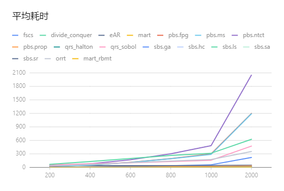

测试代码来自于/src/simulation/TestEffectiveness，通过设置运行时的时间戳得到不同算法在不同pointNum下的平均运行耗时。可以看出，随着pointNum的增加，平均耗时也逐渐增加。同时，在几种算法中， pbs.ntct的耗时最长，说明其算法复杂度也最高。考虑到随机测试本身就因为测试的性质具备一定随机性，因此每次测试的最终结果都会出现波动，但是总体来说趋势和表现是一致的。

尤其需要注意的是，eAR算法在pointNum在400和600的时候出现了下降趋势，由于eAR算法与pointNum的变化关系不大，我们也不难发现，纯随机测试的随机分布并不均匀。（呼应QRS中的低差异序列）

这是我们的测试数据：

| series         | x    | y        |
| -------------- | ---- | -------- |
| fscs           | 200  | 2.563    |
| fscs           | 400  | 9.351    |
| fscs           | 600  | 21.6     |
| fscs           | 800  | 36.624   |
| fscs           | 1000 | 57.775   |
| divide_conquer | 200  | 0.243    |
| divide_conquer | 400  | 0.346    |
| divide_conquer | 600  | 0.504    |
| divide_conquer | 800  | 0.617    |
| divide_conquer | 1000 | 0.753    |
| eAR            | 200  | 38.829   |
| eAR            | 400  | 40.089   |
| eAR            | 600  | 39.677   |
| eAR            | 800  | 40.796   |
| eAR            | 1000 | 41.683   |
| mart           | 200  | 0.547    |
| mart           | 400  | 0.963    |
| mart           | 600  | 1.4      |
| mart           | 800  | 1.871    |
| mart           | 1000 | 2.333    |
| pbs.fpg        | 200  | 15.261   |
| pbs.fpg        | 400  | 52.256   |
| pbs.fpg        | 600  | 112.343  |
| pbs.fpg        | 800  | 195.348  |
| pbs.fpg        | 1000 | 298.557  |
| pbs.ms         | 200  | 14.364   |
| pbs.ms         | 400  | 51.874   |
| pbs.ms         | 600  | 111.049  |
| pbs.ms         | 800  | 191.225  |
| pbs.ms         | 1000 | 288.879  |
| pbs.ntct       | 200  | 20.564   |
| pbs.ntct       | 400  | 77.703   |
| pbs.ntct       | 600  | 169.595  |
| pbs.ntct       | 800  | 301.824  |
| pbs.ntct       | 1000 | 482.656  |
| pbs.prop       | 200  | 3.63     |
| pbs.prop       | 400  | 7.087    |
| pbs.prop       | 600  | 10.554   |
| pbs.prop       | 800  | 13.923   |
| pbs.prop       | 1000 | 17.892   |
| qrs_halton     | 200  | 0.226    |
| qrs_halton     | 400  | 0.314    |
| qrs_halton     | 600  | 0.462    |
| qrs_halton     | 800  | 0.614    |
| qrs_halton     | 1000 | 0.727    |
| qrs_sobol      | 200  | 53.862   |
| qrs_sobol      | 400  | 81.252   |
| qrs_sobol      | 600  | 101.17   |
| qrs_sobol      | 800  | 128.542  |
| qrs_sobol      | 1000 | 159.102  |
| sbs.ga         | 200  | 1.227    |
| sbs.ga         | 400  | 2.33     |
| sbs.ga         | 600  | 3.399    |
| sbs.ga         | 800  | 4.515    |
| sbs.ga         | 1000 | 5.705    |
| sbs.hc         | 200  | 0.95     |
| sbs.hc         | 400  | 1.738    |
| sbs.hc         | 600  | 2.632    |
| sbs.hc         | 800  | 3.403    |
| sbs.hc         | 1000 | 4.416    |
| sbs.ls         | 200  | 66.399   |
| sbs.ls         | 400  | 130.719  |
| sbs.ls         | 600  | 198.097  |
| sbs.ls         | 800  | 264.057  |
| sbs.ls         | 1000 | 314.543  |
| sbs.sa         | 200  | 1.077    |
| sbs.sa         | 400  | 1.818    |
| sbs.sa         | 600  | 2.616    |
| sbs.sa         | 800  | 3.527    |
| sbs.sa         | 1000 | 4.411    |
| sbs.sr         | 200  | 1.45     |
| sbs.sr         | 400  | 2.505    |
| sbs.sr         | 600  | 3.658    |
| sbs.sr         | 800  | 4.91     |
| sbs.sr         | 1000 | 6.32     |
| orrt           | 200  | 33.681   |
| orrt           | 400  | 65.621   |
| orrt           | 600  | 105.379  |
| orrt           | 800  | 139.97   |
| orrt           | 1000 | 174.839  |
| mart_rbmt      | 200  | 0.547    |
| mart_rbmt      | 400  | 0.963    |
| mart_rbmt      | 600  | 1.4      |
| mart_rbmt      | 800  | 1.871    |
| mart_rbmt      | 1000 | 2.333    |
| fscs           | 2000 | 220.928  |
| divide_conquer | 2000 | 1.487    |
| eAR            | 2000 | 47.337   |
| mart           | 2000 | 4.583    |
| pbs.fpg        | 2000 | 1198.466 |
| pbs.ms         | 2000 | 1191.056 |
| pbs.ntct       | 2000 | 2048.674 |
| pbs.prop       | 2000 | 35.127   |
| qrs_halton     | 2000 | 1.461    |
| qrs_sobol      | 2000 | 472.625  |
| sbs.ga         | 2000 | 11.643   |
| sbs.hc         | 2000 | 8.442    |
| sbs.ls         | 2000 | 624.395  |
| sbs.sa         | 2000 | 8.754    |
| sbs.sr         | 2000 | 12.662   |
| orrt           | 2000 | 351.679  |
| mart_rbmt      | 2000 | 4.583    |

### Effectiveness 测试效率

在测试效率的图表中，x轴是设置的输入域中的错误覆盖率，y轴是F-Measure

#### Block

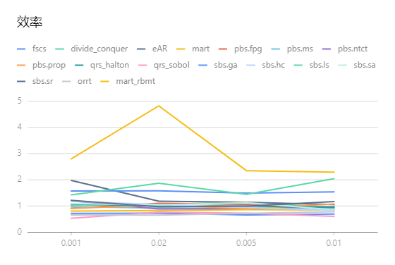

这是在模拟缺陷的块缺陷中的模拟结果，可以看到绝大多数随机算法的测试效率基本接近，而且这些接近的算法都有一个共同的特点：认为错误用例是连续分布在输入域中的。

同时rbmt算法的表现较差，很可能是算法实现出了问题。。。

同时SBS.LS算法，即本地传播算法在块状分布的输入域中对错误的触发能力也不够强，这也和本地传播的实现方式有关。本地传播算法在初始定位了正确用例后向周围传播，不符合错误测试用例周围存在连续错误的逻辑。

| fscs           | 0.001 | 0.72214 |
| -------------- | ----- | ------- |
| fscs           | 0.02  | 0.7281  |
| fscs           | 0.005 | 0.6614  |
| fscs           | 0.01  | 0.6935  |
| divide_conquer | 0.001 | 1.03537 |
| divide_conquer | 0.02  | 1.06166 |
| divide_conquer | 0.005 | 1.14225 |
| divide_conquer | 0.01  | 0.9411  |
| eAR            | 0.001 | 1.97418 |
| eAR            | 0.02  | 1.18472 |
| eAR            | 0.005 | 1.1453  |
| eAR            | 0.01  | 1.0522  |
| mart           | 0.001 | 0.80745 |
| mart           | 0.02  | 0.82768 |
| mart           | 0.005 | 0.8576  |
| mart           | 0.01  | 0.8475  |
| pbs.fpg        | 0.001 | 0.91191 |
| pbs.fpg        | 0.02  | 1.10548 |
| pbs.fpg        | 0.005 | 1.0598  |
| pbs.fpg        | 0.01  | 0.866   |
| pbs.ms         | 0.001 | 0.97777 |
| pbs.ms         | 0.02  | 0.9184  |
| pbs.ms         | 0.005 | 0.90855 |
| pbs.ms         | 0.01  | 0.9224  |
| pbs.ntct       | 0.001 | 1.1947  |
| pbs.ntct       | 0.02  | 0.88928 |
| pbs.ntct       | 0.005 | 0.9026  |
| pbs.ntct       | 0.01  | 0.9777  |
| pbs.prop       | 0.001 | 0.90822 |
| pbs.prop       | 0.02  | 1.03166 |
| pbs.prop       | 0.005 | 0.89575 |
| pbs.prop       | 0.01  | 1.0754  |
| qrs_halton     | 0.001 | 1.06809 |
| qrs_halton     | 0.02  | 1.01418 |
| qrs_halton     | 0.005 | 0.99715 |
| qrs_halton     | 0.01  | 0.9512  |
| qrs_sobol      | 0.001 | 0.52808 |
| qrs_sobol      | 0.02  | 0.76394 |
| qrs_sobol      | 0.005 | 0.7234  |
| qrs_sobol      | 0.01  | 0.6051  |
| sbs.ga         | 0.001 | 1.5748  |
| sbs.ga         | 0.02  | 1.5824  |
| sbs.ga         | 0.005 | 1.494   |
| sbs.ga         | 0.01  | 1.5366  |
| sbs.hc         | 0.001 | 1.17559 |
| sbs.hc         | 0.02  | 1.05554 |
| sbs.hc         | 0.005 | 0.9387  |
| sbs.hc         | 0.01  | 0.8365  |
| sbs.ls         | 0.001 | 1.424   |
| sbs.ls         | 0.02  | 1.87122 |
| sbs.ls         | 0.005 | 1.44655 |
| sbs.ls         | 0.01  | 2.0449  |
| sbs.sa         | 0.001 | 1.0883  |
| sbs.sa         | 0.02  | 1.04066 |
| sbs.sa         | 0.005 | 1.1306  |
| sbs.sa         | 0.01  | 0.8545  |
| sbs.sr         | 0.001 | 1.2194  |
| sbs.sr         | 0.02  | 0.96642 |
| sbs.sr         | 0.005 | 0.9947  |
| sbs.sr         | 0.01  | 1.1661  |
| orrt           | 0.001 | 0.66174 |
| orrt           | 0.02  | 0.65274 |
| orrt           | 0.005 | 0.7197  |
| orrt           | 0.01  | 0.7776  |
| mart_rbmt      | 0.001 | 2.7985  |
| mart_rbmt      | 0.02  | 4.8199  |
| mart_rbmt      | 0.005 | 2.3485  |
| mart_rbmt      | 0.01  | 2.2896  |

#### Point

可以看出来，sbs.ls和rbmt、mart方法在点式分布的输入域中表现不佳，这也和它们的实现方式有关，LS是本地传播方法的基于搜索的随机测试的实现，MART和rbmt都是Mirror Adaptive Random Test的方法，它们的原理是将输入域镜像分割，从而获得一个均匀的输入域，这并不适用于点式分布的输入域。

| fscs           | 0.001 | 1.00552 |
| -------------- | ----- | ------- |
| fscs           | 0.02  | 1.07502 |
| fscs           | 0.005 | 0.89445 |
| fscs           | 0.01  | 0.9211  |
| divide_conquer | 0.001 | 0.97133 |
| divide_conquer | 0.02  | 0.98086 |
| divide_conquer | 0.005 | 0.8792  |
| divide_conquer | 0.01  | 1.0135  |
| eAR            | 0.001 | 1.34632 |
| eAR            | 0.02  | 1.387   |
| eAR            | 0.005 | 1.44135 |
| eAR            | 0.01  | 0.6415  |
| mart           | 0.001 | 2.0257  |
| mart           | 0.02  | 1.1305  |
| mart           | 0.005 | 1.36525 |
| mart           | 0.01  | 2.0257  |
| pbs.fpg        | 0.001 | 0.9969  |
| pbs.fpg        | 0.02  | 0.90552 |
| pbs.fpg        | 0.005 | 0.85395 |
| pbs.fpg        | 0.01  | 0.9188  |
| pbs.ms         | 0.001 | 1.07137 |
| pbs.ms         | 0.02  | 0.85892 |
| pbs.ms         | 0.005 | 1.07015 |
| pbs.ms         | 0.01  | 0.9493  |
| pbs.ntct       | 0.001 | 0.93577 |
| pbs.ntct       | 0.02  | 0.90242 |
| pbs.ntct       | 0.005 | 0.96205 |
| pbs.ntct       | 0.01  | 0.959   |
| pbs.prop       | 0.001 | 0.92534 |
| pbs.prop       | 0.02  | 1.01364 |
| pbs.prop       | 0.005 | 0.95135 |
| pbs.prop       | 0.01  | 0.9629  |
| qrs_halton     | 0.001 | 1.006   |
| qrs_halton     | 0.02  | 1.08046 |
| qrs_halton     | 0.005 | 0.9645  |
| qrs_halton     | 0.01  | 0.8212  |
| qrs_sobol      | 0.001 | 0.988   |
| qrs_sobol      | 0.02  | 0.9911  |
| qrs_sobol      | 0.005 | 1.067   |
| qrs_sobol      | 0.01  | 0.8904  |
| sbs.ga         | 0.001 | 1.4831  |
| sbs.ga         | 0.02  | 1.60172 |
| sbs.ga         | 0.005 | 1.3635  |
| sbs.ga         | 0.01  | 1.0227  |
| sbs.hc         | 0.001 | 1.01166 |
| sbs.hc         | 0.02  | 0.89376 |
| sbs.hc         | 0.005 | 0.91275 |
| sbs.hc         | 0.01  | 1.0059  |
| sbs.ls         | 0.001 | 1.8146  |
| sbs.ls         | 0.02  | 1.71316 |
| sbs.ls         | 0.005 | 1.4214  |
| sbs.ls         | 0.01  | 2.0097  |
| sbs.sa         | 0.001 | 0.97868 |
| sbs.sa         | 0.02  | 0.95408 |
| sbs.sa         | 0.005 | 1.07445 |
| sbs.sa         | 0.01  | 1.0175  |
| sbs.sr         | 0.001 | 1.09264 |
| sbs.sr         | 0.02  | 0.92562 |
| sbs.sr         | 0.005 | 1.0267  |
| sbs.sr         | 0.01  | 0.9098  |
| orrt           | 0.001 | 0.9244  |
| orrt           | 0.02  | 0.93644 |
| orrt           | 0.005 | 0.94055 |
| orrt           | 0.01  | 0.9557  |
| mart_rbmt      | 0.001 | 3.07408 |
| mart_rbmt      | 0.02  | 1.86028 |
| mart_rbmt      | 0.005 | 2.8476  |
| mart_rbmt      | 0.01  | 2.0427  |

#### strip

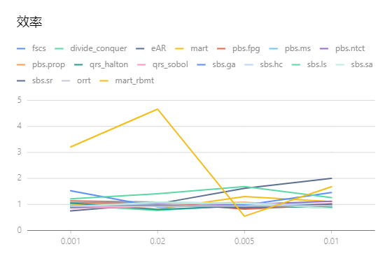

可以看到，在Strip分布下的各随机测试算法在FailureRate增大的同时都趋近于1，值得注意的是ntct算法，在大多数算法都在向Fart/Frt = 1集中式，ntct在测试中的趋势反而是递增的。

| fscs           | 0.001 | 0.8809  |
| -------------- | ----- | ------- |
| fscs           | 0.02  | 1.01164 |
| fscs           | 0.005 | 0.8936  |
| fscs           | 0.01  | 0.9245  |
| divide_conquer | 0.001 | 0.96515 |
| divide_conquer | 0.02  | 0.774   |
| divide_conquer | 0.005 | 0.9675  |
| divide_conquer | 0.01  | 0.9984  |
| eAR            | 0.001 | 0.75407 |
| eAR            | 0.02  | 1.02492 |
| eAR            | 0.005 | 1.6209  |
| eAR            | 0.01  | 2.0002  |
| mart           | 0.001 | 1.02492 |
| mart           | 0.02  | 0.8189  |
| mart           | 0.005 | 1.3063  |
| mart           | 0.01  | 1.1068  |
| pbs.fpg        | 0.001 | 1.13502 |
| pbs.fpg        | 0.02  | 1.09    |
| pbs.fpg        | 0.005 | 0.81855 |
| pbs.fpg        | 0.01  | 0.9806  |
| pbs.ms         | 0.001 | 1.06728 |
| pbs.ms         | 0.02  | 1.07954 |
| pbs.ms         | 0.005 | 1.0482  |
| pbs.ms         | 0.01  | 1.003   |
| pbs.ntct       | 0.001 | 1.05552 |
| pbs.ntct       | 0.02  | 1.03996 |
| pbs.ntct       | 0.005 | 1.0011  |
| pbs.ntct       | 0.01  | 1.119   |
| pbs.prop       | 0.001 | 1.03274 |
| pbs.prop       | 0.02  | 1.0083  |
| pbs.prop       | 0.005 | 1.0842  |
| pbs.prop       | 0.01  | 0.9089  |
| qrs_halton     | 0.001 | 1.0541  |
| qrs_halton     | 0.02  | 0.80932 |
| qrs_halton     | 0.005 | 0.938   |
| qrs_halton     | 0.01  | 0.8785  |
| qrs_sobol      | 0.001 | 0.85633 |
| qrs_sobol      | 0.02  | 0.9294  |
| qrs_sobol      | 0.005 | 0.95715 |
| qrs_sobol      | 0.01  | 1.0308  |
| sbs.ga         | 0.001 | 1.5272  |
| sbs.ga         | 0.02  | 0.9082  |
| sbs.ga         | 0.005 | 0.97635 |
| sbs.ga         | 0.01  | 1.4586  |
| sbs.hc         | 0.001 | 0.94348 |
| sbs.hc         | 0.02  | 1.01352 |
| sbs.hc         | 0.005 | 1.0628  |
| sbs.hc         | 0.01  | 0.9445  |
| sbs.ls         | 0.001 | 1.2181  |
| sbs.ls         | 0.02  | 1.4085  |
| sbs.ls         | 0.005 | 1.6854  |
| sbs.ls         | 0.01  | 1.2642  |
| sbs.sa         | 0.001 | 0.90728 |
| sbs.sa         | 0.02  | 1.09132 |
| sbs.sa         | 0.005 | 1.03665 |
| sbs.sa         | 0.01  | 0.8556  |
| sbs.sr         | 0.001 | 0.89919 |
| sbs.sr         | 0.02  | 0.97736 |
| sbs.sr         | 0.005 | 0.86955 |
| sbs.sr         | 0.01  | 1.0175  |
| orrt           | 0.001 | 0.9244  |
| orrt           | 0.02  | 0.93644 |
| orrt           | 0.005 | 0.94055 |
| orrt           | 0.01  | 0.9557  |
| mart_rbmt      | 0.001 | 3.21207 |
| mart_rbmt      | 0.02  | 4.66358 |
| mart_rbmt      | 0.005 | 0.5481  |
| mart_rbmt      | 0.01  | 1.682   |

### 各算法的效率

考虑到17种算法的测试结果混在一起过于复杂，我们单独对每个算法测试其在不同错误域上的表现。

#### FSCS

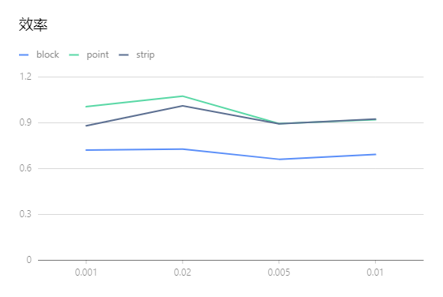

可以看到在不同Failrate中FSCS的F-Measure表现差异不大，同时在块状分布的错误域中表现较好，在点状分布的错误分布中表现较差。

#### Divide_Conquer

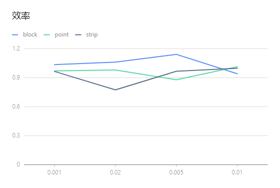

Divide_Conquer作为复合型方法，结合STFCS + PBS，在Failerate较大的情况下，不同分布中的测试效果相近，相对来说比较适合于大部分错误输出的生成。

#### eAR

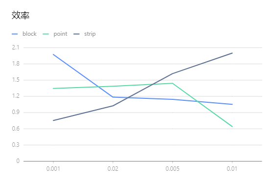

eAR算法十分依赖FailureRate，在block和point分布类型中，更适合用于检测错误率较高的数值程序。

#### mart

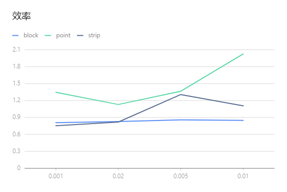

MART在block和strip这样连续分布的情况中有着不错的表现，且相对稳定，但是不适用于point分布。

#### rbmt

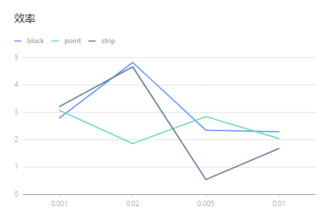

 rbmt不知道是不是实现的算法与理论的数学模型不太符合，最终的效果比较差...且波动大，不适合使用

#### PBS.FPG

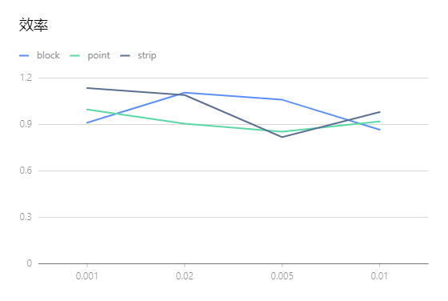

FPG算法优先选择与已执行输入差异更大的输入集，最终表现也比较均匀（根据PBS的几个算法总结，似乎这是PBS的特点），适合各种情况。

#### PBS.MS

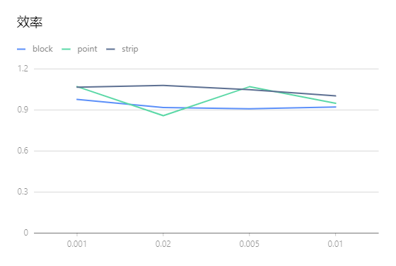

MS的算法在不同领域的效果基本接近，且效果不错。

#### PBS.NTCT

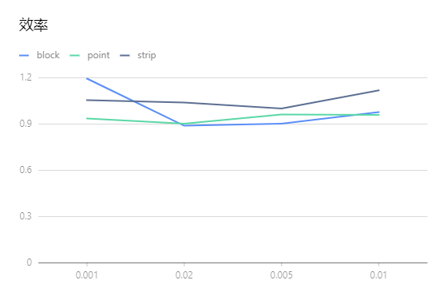

#### PBS.Prop

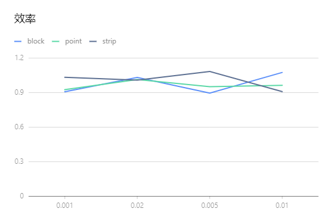

#### QRS.Halton

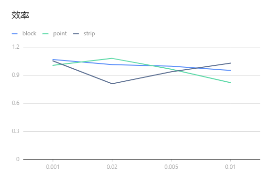

Halton序列生成的伪随机数的表现基本类似，毕竟Halton的原理就是生成更加均匀的测试输入，因此最终效果符合对算法的认知。

#### QRS.Sobol

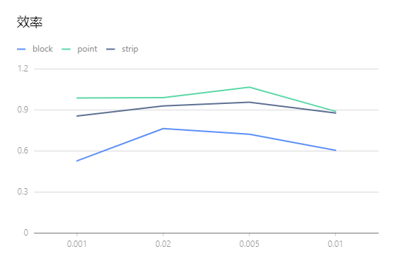

Sobol序列生成的随机输入效果在不同分布下有着显著不同，尤其是在block下效果尤其好，这其实不太符合我们对Sobol序列的认知，但是Sobol序列的均匀性和生成矩阵密切相关，有这样的效果应该和使用的生成矩阵的文件有关。

#### ORRT

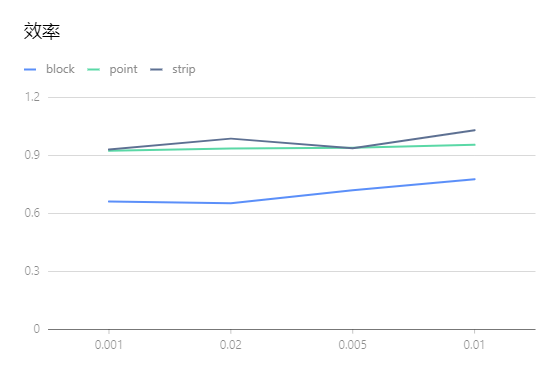

ORRT通过在正确的输入周围建立隔离域，可以第一时间筛选出大规模的差异度较大的测试用例集，因此在block中表现很好，者和预期相符和。

#### SBS.GA

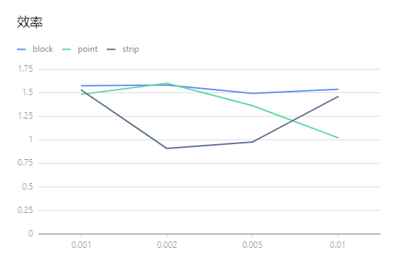

基于搜索的算法表现和使用的算法密切相关。这里使用了遗传算法，可以看到与错误用例数的大小密切相关，在不同的FailureRate下表现各有不同。

## 数值程序检测

### Bessj

FailureRate=0.01

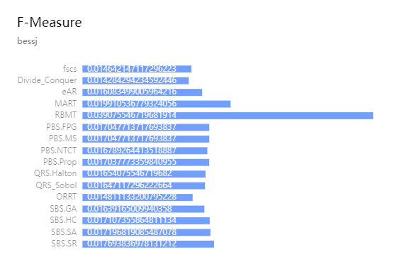